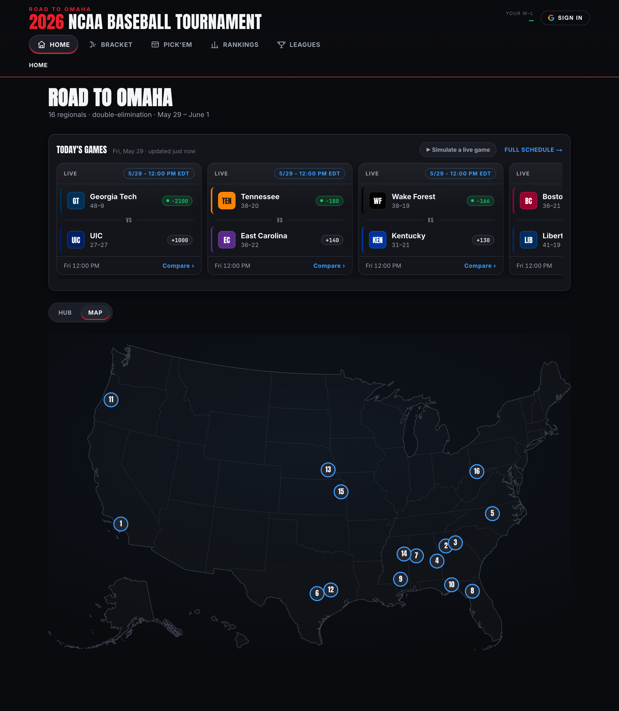
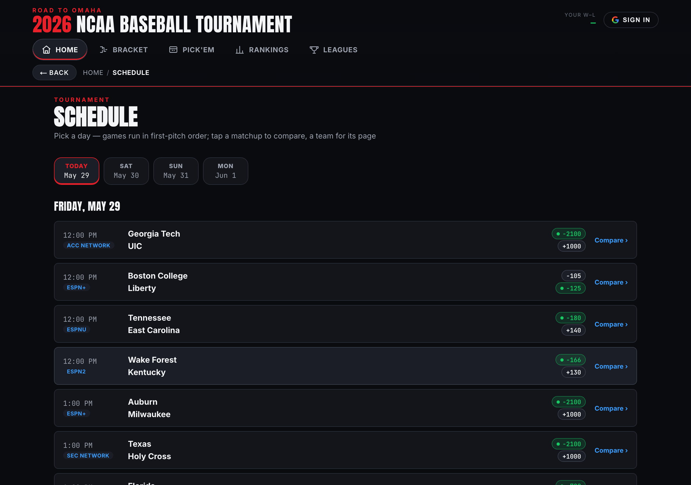
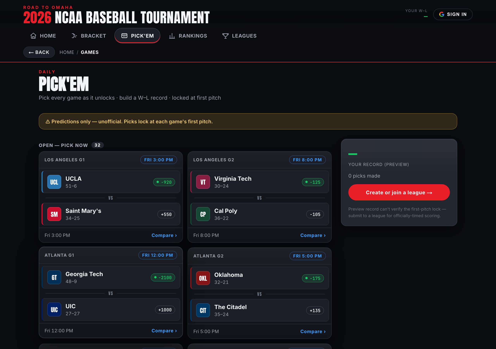
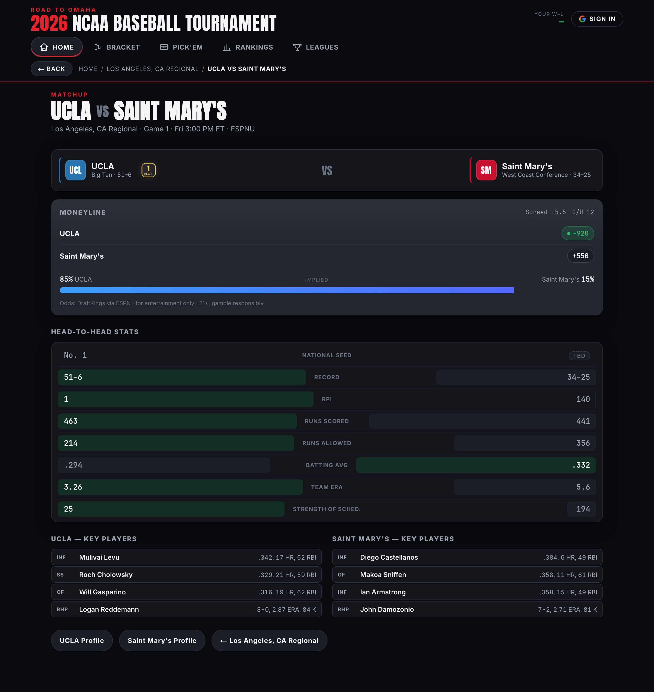
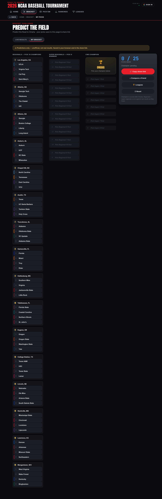
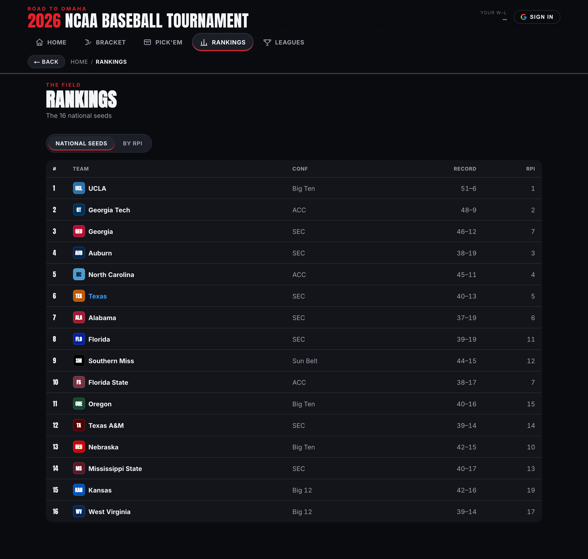
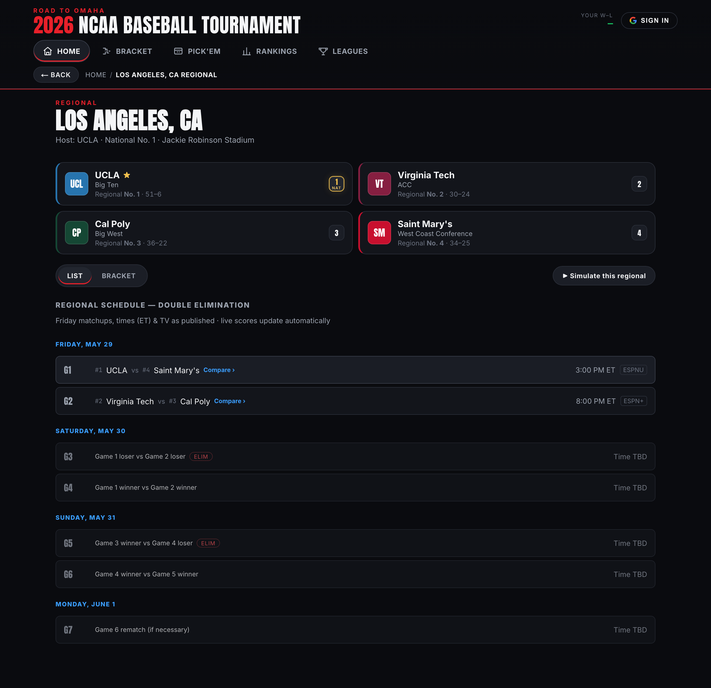
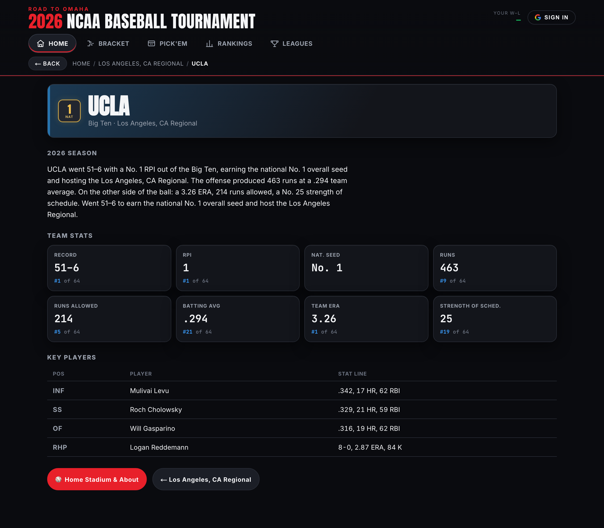
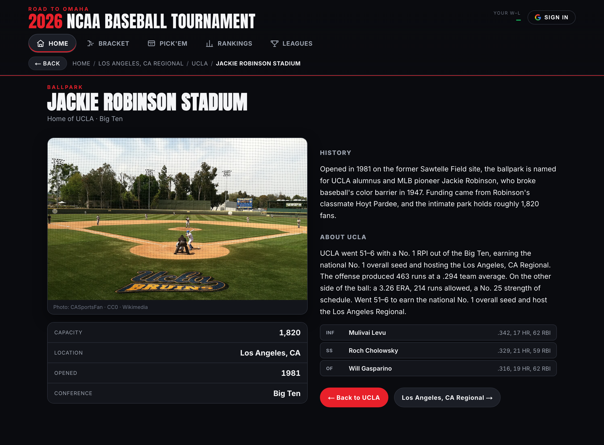

# 2026 NCAA Baseball Tournament — Interactive Map

**Live site: [swishtd.com](https://swishtd.com)**

[](https://github.com/teddygcodes/2026-cws-map/actions/workflows/ci.yml)
[](https://github.com/teddygcodes/2026-cws-map/actions/workflows/refresh.yml)
[](LICENSE)

An interactive, broadcast-styled guide to the **2026 NCAA Division I Baseball Tournament** — the Road to Omaha. Explore all 16 regional sites on a static US map, browse a full by-day schedule with start times, TV, and live betting lines, compare teams head-to-head, read full season stats and home-ballpark pages, and play two prediction games — a full-bracket challenge and a daily per-game pick'em — with optional private leagues. Live scores, innings, and box scores update on their own once games begin.

It is a **Next.js 14 (App Router) + React** app deployed on **Vercel**. The whole app works fully signed-out; an optional Google sign-in (Auth.js) syncs your picks across devices.

> **About the data.** The 64-team field was set **May 25, 2026**; regionals run **May 29 – June 1**. Verified season stats and the published Friday schedule are baked in; live scores and odds are fetched at runtime from ESPN. Anything that could not be verified is shown as a visible `TBD` rather than invented — see [Data and honesty](#data-and-honesty).

---

## Contents

- [Highlights](#highlights)
- [Features](#features)
- [Data and honesty](#data-and-honesty)
- [Quick start](#quick-start)
- [Project structure](#project-structure)
- [Development and testing](#development-and-testing)
- [Private leagues (optional backend)](#private-leagues-optional-backend)
- [Sign-in and pick sync (optional)](#sign-in-and-pick-sync-optional)
- [Super-regional upgrade](#super-regional-upgrade)
- [Tech stack](#tech-stack)
- [License](#license)
- [Screenshots](#screenshots)

---

## Highlights

- **One home for all 16 regionals** — a self-updating scoreboard ticker over a static US map of every host site, with seed-numbered pins and a pulsing dot for any site with a game in progress. No backend required.
- **A real by-day schedule** — pick a day (it defaults to today and advances on its own), see every game in first-pitch order with its time, TV network, and live moneyline; past days stay one tap away to review finals.
- **Two prediction games in one app** — fill out the whole bracket once, or pick the winner of every individual game as it unlocks and build a running W–L record.
- **Real betting lines** — moneylines are pulled live from ESPN and shown on the schedule, on each matchup card, and on the head-to-head comparison — clearly attributed, never fabricated.
- **Honest by design** — every number is sourced; unverifiable values render as a visible `TBD`. The only simulated content is an explicitly labeled "Simulate a live game" preview.

---

## Features

### Explore the field
- **Home** — a self-updating scoreboard ticker (today's games with times, scores, and odds), a static, full-width US map of all 16 host ballparks with seed-numbered pins, and a **Hub · Map** toggle that swaps the map for a scannable card grid of every regional. Clicking a pin opens the regional.
- **Schedule** (`#/schedule`) — clickable day tabs (Fri May 29 → Mon Jun 1, plus the super-regionals once they're set). Only the selected day shows, ordered by first pitch, each row with its time, TV network, and live moneyline. Tap a matchup to compare; tap a team name for its page. Decided games show the final; undetermined later-round games stay labeled with their double-elimination feeder ("G1 winner vs G2 winner").
- **Regional view** — the four teams with regional seed (1–4), conference, and record, plus the full **double-elimination bracket** and Friday's real matchups, times, and TV.
- **National bracket** (`#/bracket`) — the Road to Omaha laid out from 16 regional champions to 8 super-regional winners to a national champion, resolving automatically as results come in. A toggle flips between **Live Results** and your editable **Bracket Challenge** picks on the same tree.
- **Rankings** (`#/rankings`) — the 16 national seeds as a sortable table (by seed or RPI) with record and conference.

### Teams and venues
- **Team pages** — a full stat card (record, RPI, runs, runs allowed, team AVG/ERA, strength of schedule) with each stat's **rank in the field**, key-player stat lines, and an honest 2026-season write-up generated purely from the verified data.
- **Stadium / About pages** — the home ballpark with a real, attributed photo (Wikimedia Commons), capacity, verified city/state and year opened, and a researched history blurb.

### Live game data
- **Scoreboard ticker** — polls ESPN's public college-baseball feed roughly every 30 seconds (paused when the tab is hidden) and flows every tournament game through Upcoming → Live (inning and score) → Final on its own. A clearly labeled **Simulate a live game** button previews the live experience before first pitch.
- **Box scores** — open any live or final game for an inning-by-inning linescore with runs, hits, and errors.

### Compare and predict
- **Matchup comparison** — a pregame head-to-head on record, RPI, runs, ERA, batting average, strength of schedule, and key players, with the statistical edge highlighted on each line — plus a **live moneyline** (favorite flagged, spread/total when posted) sourced from ESPN, with attribution and a responsible-gambling note.
- **Bracket Challenge** (`#/picks`) — predict the entire Road to Omaha (16 regional champions, 8 super-regional winners, one national champion). Your bracket saves locally and to a **shareable link** (picks are encoded in the URL), with a head-to-head compare against a friend's link. Picks are scored against real results as games finish, always labeled as unofficial predictions.
- **Daily pick'em** (`#/games`) — pick the winner of **every game** as its matchup unlocks (regionals G1–G7, super-regionals best-of-three), building a running W–L record. Each card shows the first-pitch time, the live moneyline, and a one-click link to the full comparison. Picks lock at each game's first pitch.
- **Private leagues** *(optional)* — compete with friends on a shared league code with **two leaderboards in one league**: the Bracket Challenge and the Daily pick'em. This is the only feature with its own backend — a small Cloudflare Worker plus KV (all scoring still happens in the browser; per-game fairness is enforced by server-stamped pick timestamps). It is **off by default**; see [`worker/README.md`](worker/README.md) to deploy it.

### Design
An ESPN-style dark broadcast theme built on a bespoke **design-token system** (charcoal and broadcast red), Anton display type / Inter UI / JetBrains Mono numerics via `next/font`, smooth view transitions, hash-based routing with working back/forward and scroll restoration, and a mobile-friendly responsive layout with a bottom tab bar.

---

## Data and honesty

This project's premise is honest data, so it **never fabricates a value and presents it as fact.**

| Source | Used for |
| --- | --- |
| Official field (set 5/25/2026) | The 16 regionals, 64 teams, national seeds, regional seeds, host parks |
| Official athletics sites, [WarrenNolan](https://www.warrennolan.com), [TheBaseballCube](https://www.thebaseballcube.com), [D1Baseball](https://d1baseball.com) | Records, RPI, team runs/ERA/AVG, strength of schedule, key-player stat lines (as of 5/25/2026) |
| Published bracket (247Sports / ESPN) | Friday matchups, start times (ET), TV networks |
| [ESPN public API](https://site.api.espn.com) | Live scores, innings, box scores, and betting moneylines (fetched at runtime) |
| [Wikimedia Commons](https://commons.wikimedia.org) | Stadium photos (per-image attribution in `photos.js`) |

Any value that could not be verified renders as a visible **`TBD`** badge, and stadium coordinates are best-known approximations flagged in `data.js`. Later-round bracket matchups stay `TBD` because they depend on results. Betting lines follow the same rule — an absent or "OFF" line is shown as "Not posted yet," never invented.

**Records refresh themselves nightly.** Once games start, the field that goes stale is each team's W–L record. A scheduled GitHub Action (`scripts/refresh-stats.mjs`, see [`refresh.yml`](.github/workflows/refresh.yml)) pulls current records from ESPN each night, re-serializes `data.js`, and — only if a record actually changed and the data still passes validation — commits to `main`, which redeploys via Vercel. The honesty rule still holds: a team whose record cannot be fetched keeps its existing value (never nulled), and an unreachable source fails the job rather than writing garbage. Everything else (RPI, strength of schedule, rate stats, players) stays at the verified 5/25 snapshot.

This is an unofficial, non-commercial fan and educational project — not affiliated with the NCAA, ESPN, or any school.

---

## Quick start

```bash
npm install
npm run dev            # Next dev server on http://localhost:3000 (syncs data first)
```

Then exercise the flow in a browser: the map renders pins, drill-down works, the scoreboard loads upcoming games, the schedule lists by day, and comparison, box scores, and picks all open.

```bash
npm run build          # production build (runs the data sync, then `next build`)
npm run start          # serve the production build
```

---

## Project structure

```
.
├── app/
│   ├── page.jsx           # server component: resolves the Auth.js session, renders <AppShell>
│   ├── layout.jsx         # design tokens + global CSS + next/font (Anton / Inter / JetBrains Mono)
│   ├── (app)/
│   │   ├── AppShell.jsx    # client root: provider stack + masthead + hash-routed view tree
│   │   ├── Routes.jsx      # 1:1 hash → view switch
│   │   ├── providers/      # Data, Live (ESPN polling), Picks, GamePicks, Leagues
│   │   └── views/          # Home, Schedule, Regional, Team, Stadium, Compare, Game,
│   │                       #   NationalBracket, Picks, H2H, Games, League, Rankings
│   ├── components/        # shared library (TeamToken, OddsChip, ProbBar, UsMap, MatchupCard, …)
│   └── api/               # Auth.js route + /api/picks sync
├── lib/                   # pure, Node-testable logic: format, picks, games, live-parse, ranks, team-colors
├── data.js                # canonical TOURNAMENT model — 16 sites, 64 teams, stats, stadiums
├── photos.js              # stadium photo map + Wikimedia attribution
├── schedule.js            # real Friday matchups / times / TV per regional
├── bracket.js             # pure double-elimination resolver
├── public/legacy/         # the four data files above, synced here for runtime load
├── worker/                # optional private-league backend (Cloudflare Worker + KV)
├── scripts/               # validate, test-*, smoke, refresh-stats, sync-legacy, screenshots
├── .github/workflows/     # CI (validate → build + smoke) + nightly record refresh
└── docs/screenshots/      # images used in this README
```

At runtime the four data files (`data.js`, `photos.js`, `schedule.js`, `bracket.js`) are loaded by `DataProvider` from `public/legacy/`; `predev`/`prebuild` run `scripts/sync-legacy.mjs` to copy them there.

Routing is hash-based and runs through `useHashRoute`:
`#/`, `#/r/:site`, `#/t/:team`, `#/s/:team`, `#/vs/:a/:b`, `#/g/:event`, `#/bracket`, `#/picks` (`+/:code`), `#/h2h/:a/:b`, `#/games`, `#/league` (`+/:code`), `#/rankings`, `#/schedule`.

---

## Development and testing

The scripts below mirror what GitHub Actions runs.

```bash
npm run validate        # data integrity (16 sites, 64 teams, seeds, refs, photos/schedule keys)
npm run refresh:check   # assert data.js is in canonical (auto-refresh) form
npm test                # bracket resolver + league validator + lib/ unit tests
npm run build           # production build (also runs the data sync)
npm run smoke           # Playwright: core views render against the Next server
npm run refresh         # fetch live records from ESPN and rewrite data.js (network)
```

For smoke locally: `npm run build && npm run start &` then `npm run smoke` (or point `BASE` at a running `npm run dev`). README screenshots are regenerated the same way with `node scripts/screenshots.mjs`.

CI gates on `validate` and `build + smoke`, so a red check never reaches production. **Deploys are handled by Vercel's Git integration** (CI no longer deploys) — treat Vercel as the source of truth for what's live.

---

## Private leagues (optional backend)

Private leagues are the one feature with their own backend: a small **Cloudflare Worker + KV** in [`worker/`](worker/), deployed separately to your own Cloudflare account. The Worker is a *dumb store* of `league → members` — it never fetches ESPN and never scores; **all scoring happens in the browser**. It is gated by `LEAGUE_API` in `LeaguesProvider`: unset disables the feature (the rest of the app is unaffected), and the deployed Worker URL turns it on.

Per-game fairness without a schedule on the server is enforced by **server-stamped pick timestamps**: a daily pick counts only if its recorded timestamp predates that game's real first pitch (which the browser knows from the live feed). See [`worker/README.md`](worker/README.md) for one-time setup and teardown.

---

## Sign-in and pick sync (optional)

The app works fully signed-out — picks live in `localStorage` and a shareable URL code. An **optional Google sign-in** (Auth.js / NextAuth with a Postgres adapter) syncs your Bracket Challenge picks across devices via `/api/picks`. Sign-in is never required; the feature is inert unless the auth + database environment variables are configured.

---

## Super-regional upgrade

This is **automatic**: when all 16 regional champions resolve from real finals, `LiveProvider` builds the 8 super-regionals (host = higher seed) and flips the round to `"super-regional"`. The views read sites/round from `LiveProvider` and are count-agnostic, so no UI change is needed. To hard-code the final field instead, set `TOURNAMENT.round` / `sites` in `data.js` (then `npm run refresh`), and set `TOURNAMENT.omahaChampion` once Omaha is decided to score the CWS-champion pick.

---

## Tech stack

- **Next.js 14 (App Router) + React 18**, deployed on **Vercel**.
- **CSS Modules** over a bespoke **design-token** layer; fonts via `next/font` (Anton, Inter, JetBrains Mono).
- **Static US map** rendered as inline SVG from **d3-geo** (`geoAlbersUsa`) + **topojson-client** + **us-atlas** — no map tiles, no external map service.
- **ESPN public scoreboard/summary endpoints** for live scores, box scores, and betting lines (polled client-side every ~30s).
- **Auth.js (NextAuth 5)** with a **Postgres** adapter for optional Google sign-in and cross-device pick sync.
- Hash-based single-page routing with working browser back/forward and scroll restoration.
- Optional **Cloudflare Worker + KV** for private leagues.

---

## License

The **source code** is released under the [MIT License](LICENSE).

Third-party content is **not** covered by that license and remains under its own terms:

- **Stadium photos** are from [Wikimedia Commons](https://commons.wikimedia.org) under their respective Creative Commons / public-domain licenses. Per-image author and license attribution is recorded in `photos.js`.
- **Live scores, box scores, and betting lines** are fetched at runtime from ESPN's public endpoints and belong to their respective owners. This is an unofficial, non-commercial fan and educational project — not affiliated with or endorsed by the NCAA, ESPN, or any institution.
- **Map geometry** is from [us-atlas](https://github.com/topojson/us-atlas) (US Census Bureau TIGER/Line, public domain).

Betting lines are shown for entertainment only. 21+. If you or someone you know has a gambling problem, call 1-800-GAMBLER.

---

## Screenshots

### Home — static regional map and live scoreboard ticker


### Schedule — games by day with times, TV, and live odds


### Daily pick'em — matchup cards with game times and live odds


### Matchup comparison — head-to-head with moneyline


### Bracket Challenge — predict the whole Road to Omaha


### Rankings — the 16 national seeds, sortable


### Regional view — bracket and double-elimination schedule


### Team view — full 2026 stats with field ranks and key players


### Stadium / About — photo, capacity, and history

