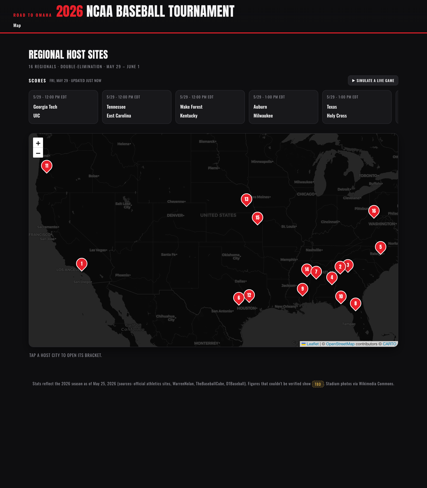
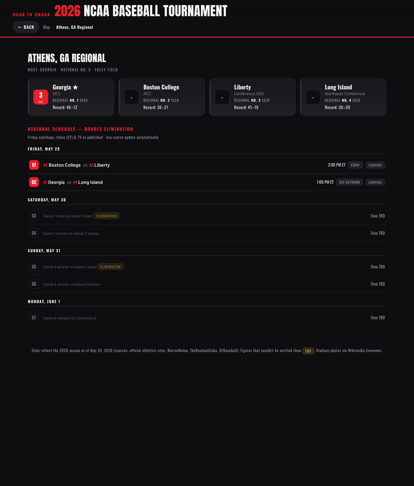
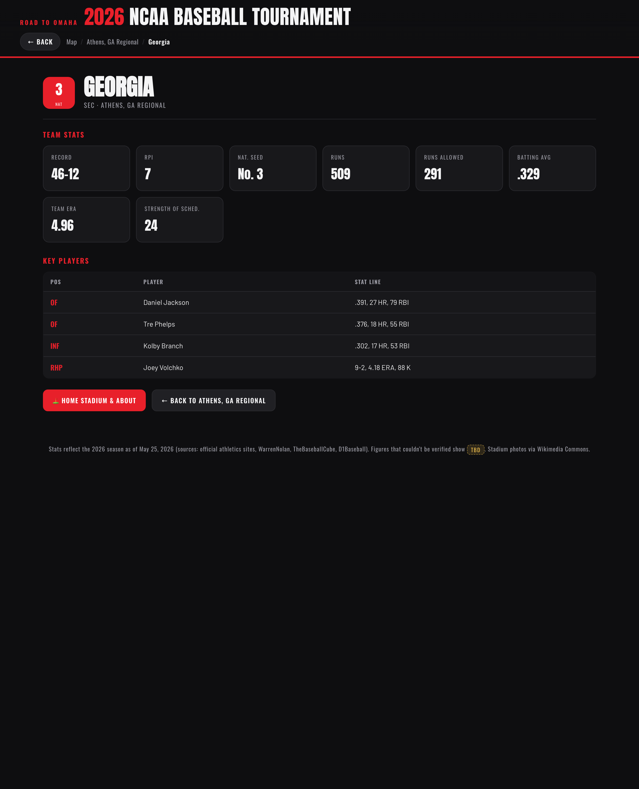
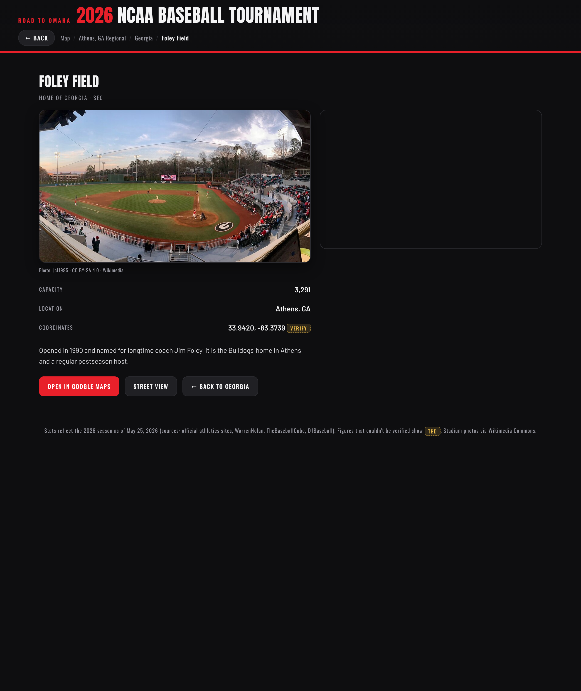
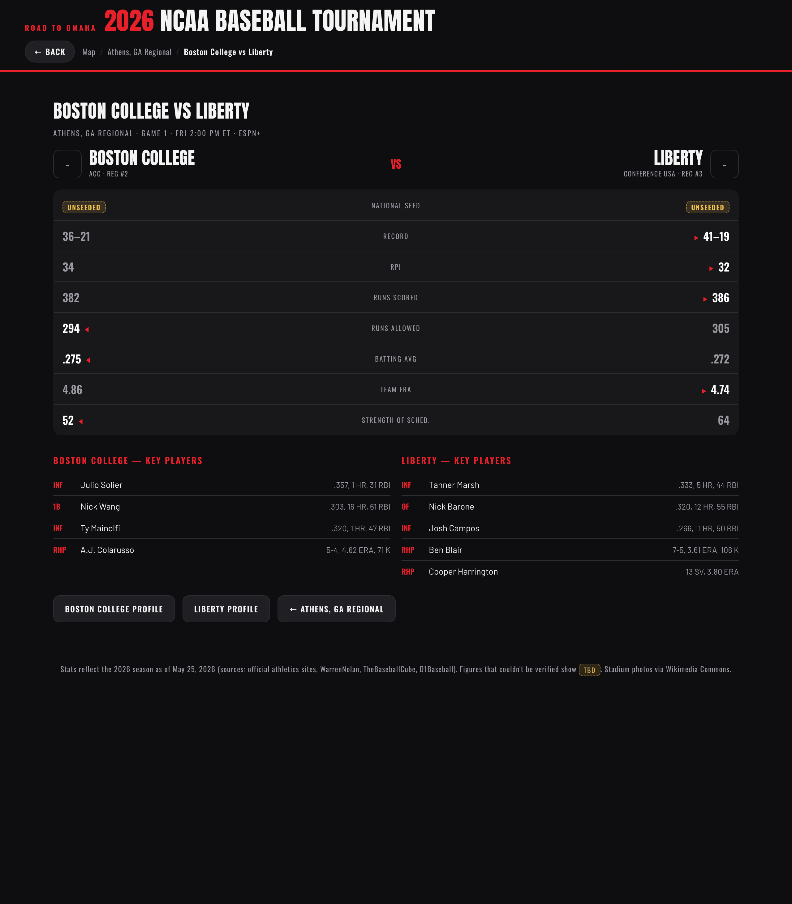
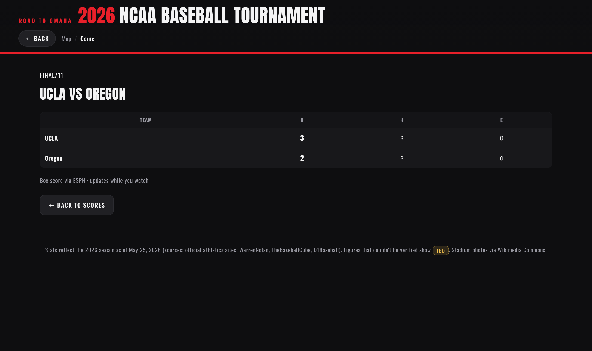

# 2026 NCAA Baseball Tournament — Interactive Map

### ▶ Live site: **https://teddygcodes.github.io/2026-cws-map/**

[](https://github.com/teddygcodes/2026-cws-map/actions/workflows/ci.yml)
[](https://github.com/teddygcodes/2026-cws-map/actions/workflows/refresh.yml)

An interactive, broadcast-styled map of the **2026 NCAA Division I Baseball Tournament** (Road to Omaha). Explore all 16 regional sites on a map, drill into each bracket, compare teams head-to-head, browse full team stats and home‑stadium pages, and watch **live scores update on their own** once games start.

It's a single static page — **no build step, no backend, no install**. Open `index.html` in a browser and it runs.

> **Note on the data:** The 64‑team field was set **May 25, 2026**; regionals run **May 29 – June 1**. Real season stats and the published Friday schedule are baked in / fetched live. Anything that genuinely wasn't known is shown as a visible `TBD` rather than invented — see [Data & honesty](#data--honesty).

---

## Quick start

No dependencies. Either:

```bash
# Option A — just open the file
open index.html            # macOS  (or double-click it)

# Option B — serve locally (recommended; lets the live scores + map tiles load cleanly)
python3 -m http.server 4173
# then visit http://localhost:4173
```

That's it. Everything is plain HTML/CSS/JS.

---

## Features

- **🗺️ Map view** — a dark Leaflet/OpenStreetMap map with a compact circular pin at each of the 16 host cities, placed on the host school's home ballpark; pins for sites with a game in progress get a pulsing **live dot**. Tap a pin to open that regional. A top‑of‑map **Map · List · Bracket** toggle switches to a tidy list of all 16 regionals (overlap‑proof navigation) or jumps straight to the national bracket — no scrolling required.
- **📊 Live scoreboard ticker** — polls ESPN's public college‑baseball feed every ~30s (no backend) and shows every tournament game flow **Upcoming → LIVE (inning + score) → Final**, all on its own. Includes a clearly‑labeled **"Simulate a live game"** button so you can preview the live experience before first pitch.
- **🏆 Regional view** — the 4 teams with regional seed (1–4), conference and record, plus the full **double‑elimination schedule** (Friday's real matchups/times/TV, then the Sat–Mon winners/losers bracket).
- **⚔️ Matchup comparison** — click a pregame matchup to get a head‑to‑head: record, RPI, runs, ERA, batting average, strength of schedule and key players, with the statistical edge highlighted for each line, plus a **live betting line** (moneyline per team, favorite flagged, spread/total when posted) pulled from ESPN — clearly attributed and for entertainment only.
- **👤 Team view** — full stat card (record, RPI, runs, runs allowed, team AVG/ERA, SOS) and key‑player stat lines.
- **🏟️ Stadium / About view** — the team's home ballpark with a real photo (Wikimedia Commons, attributed), capacity, verified **city/state** and year opened, a researched **history** blurb, and an **About the team** panel (an honest 2026-season summary built from the verified stats, plus key players).
- **🧾 2026 Season** — each team page opens with a season write-up generated from the verified data (record, RPI, seed, conference, runs/ERA/AVG/SOS), with a sourced season note where one could be verified.
- **📋 Bracket Challenge** — predict the whole Road to Omaha (16 regional champions → 8 super-regional winners → CWS champion). Your bracket saves to the page and to a **shareable link** (no login, no backend — picks are encoded in the URL), with a **head-to-head** compare against a friend's link. As real games finish, picks are scored ✓/✗ against actual results, always clearly labeled as unofficial predictions.
- **🎯 Daily pick'em** — pick the winner of **every game** as its matchup unlocks (regionals G1–G7, super-regionals best-of-3), building a running **W–L record**. Each matchup card shows the first‑pitch time, the live **moneyline**, and a one‑click link to the full head‑to‑head comparison. Picks lock at each game's first pitch.
- **🏆 Private leagues** *(optional)* — compete with friends on a shared league code with **two leaderboards in one league**: the Bracket Challenge and the Daily pick'em. The bracket locks at first pitch. This is the one feature with a backend: a tiny Cloudflare Worker + KV (all scoring still happens in the browser; per-game fairness is enforced by server-stamped pick timestamps). It's **off by default** and the rest of the app is unaffected; see [`worker/README.md`](worker/README.md) to deploy it and flip it on.
- **📦 Box score** — click a live or final game for an inning‑by‑inning linescore with R/H/E, pulled from ESPN.
- **Design** — ESPN‑style dark broadcast theme (charcoal + broadcast red), Anton/Oswald/Barlow display type, smooth view transitions, hash‑based routing with working back/forward, and a mobile‑friendly responsive layout.

---

## Data & honesty

This project deliberately **never fabricates a number and presents it as fact.**

| Source | Used for |
| --- | --- |
| Official field (set 5/25/2026) | The 16 regionals, 64 teams, national seeds, regional seeds, host parks |
| Official athletics sites, [WarrenNolan](https://www.warrennolan.com), [TheBaseballCube](https://www.thebaseballcube.com), [D1Baseball](https://d1baseball.com) | Records, RPI, team runs/ERA/AVG, strength of schedule, key‑player stat lines (as of 5/25/2026) |
| Published bracket (247Sports / ESPN) | Friday matchups, start times (ET), TV networks |
| [ESPN public API](https://site.api.espn.com) | Live scores, innings and box scores (fetched at runtime) |
| [Wikimedia Commons](https://commons.wikimedia.org) | Stadium photos (per‑image attribution in `photos.js`) |

Any value that couldn't be verified from a source is rendered as a visible **`TBD`** badge (e.g. a few teams' opponent‑run totals), and stadium coordinates are best‑known approximations flagged in `data.js`. Later‑round bracket matchups stay `TBD` because they depend on results.

**Records refresh themselves nightly.** Once games start, the one field that goes stale is each team's **W‑L record**. A scheduled GitHub Action (`scripts/refresh-stats.mjs`, see [`refresh.yml`](.github/workflows/refresh.yml)) pulls current records from ESPN each night, re‑serializes `data.js`, and — only if a record actually changed and the data still passes `validate` — commits to `main`, which redeploys. The honesty rule still holds: a team whose record can't be fetched **keeps its existing value** (never nulled), and an unreachable source fails the job rather than writing garbage. Everything else (RPI, SOS, rate stats, players) stays at the verified 5/25 snapshot — ESPN doesn't expose those for college baseball.

This is an unofficial, non‑commercial fan/educational project — not affiliated with the NCAA, ESPN, or any school.

---

## Project structure

```
.
├── index.html        # The whole app: markup, theme CSS, and all JS (router, map,
│                     # scoreboard polling, comparison, box scores, demo)
├── data.js           # Static TOURNAMENT model — 16 sites, 64 teams, stats, stadiums
├── photos.js         # Stadium photo map + Wikimedia attribution (author/license/source)
├── schedule.js       # Real Friday matchups/times/TV per regional (double-elim structure)
├── bracket.js        # Pure double-elimination resolver (regional -> super-regional)
├── images/           # Local stadium photos (so the app works offline)
├── scripts/          # Dev/CI only: validate.mjs, test-bracket.mjs, smoke.mjs, refresh-stats.mjs
├── .github/workflows/# CI (validate -> smoke -> deploy) + nightly record refresh
├── .claude/          # launch.json for the local preview server
└── docs/screenshots/ # Images used in this README
```

The data model is intentionally simple: a **Site** holds a list of team IDs, and the same component renders whether that list has 4 (regional) or 2 (super‑regional) teams.

### Super‑regional upgrade (≈ June 2)

Regionals decide who advances, then 8 super‑regionals are set. The code is built for this: every spot that changes on June 2 is marked with a `// SUPER_REGIONAL_UPGRADE` comment. The upgrade is essentially a **data‑only edit** — flip `TOURNAMENT.round` to `"super-regional"`, replace the 16 `sites` with 8 (each `teams` array goes from 4 → 2 IDs), and swap in the super‑regional schedule. The renderer is count‑agnostic, so no UI rewrite is required.

---

## Tech

- Plain **HTML / CSS / JavaScript** — zero build tooling, zero npm dependencies.
- **Leaflet** (via CDN) with CARTO dark basemap tiles (OpenStreetMap data).
- **ESPN public scoreboard/summary endpoints** for live data (CORS‑enabled, polled client‑side).
- Hash‑based single‑page routing (`#/`, `#/r/:site`, `#/t/:team`, `#/s/:team`, `#/vs/:a/:b`, `#/g/:event`).

---

## License

The **source code** of this project is released under the [MIT License](LICENSE).

Third‑party content is **not** covered by that license and remains under its own terms:

- **Stadium photos** (`images/`) are from [Wikimedia Commons](https://commons.wikimedia.org) under their respective Creative Commons / public‑domain licenses. Per‑image author and license attribution is recorded in `photos.js`.
- **Live scores and box scores** are fetched at runtime from ESPN's public endpoints and belong to their respective owners. This is an unofficial, non‑commercial fan/educational project — not affiliated with or endorsed by the NCAA, ESPN, or any institution.
- **Map tiles** are served by CARTO using OpenStreetMap data (© OpenStreetMap contributors).

---

## Screenshots

### Home — map + live scoreboard ticker


### Regional view — bracket + double-elimination schedule


### Team view — full 2026 stats & key players


### Stadium / About — photo, capacity, history, map


### Matchup comparison — pregame head-to-head


### Box score — live / final game detail

